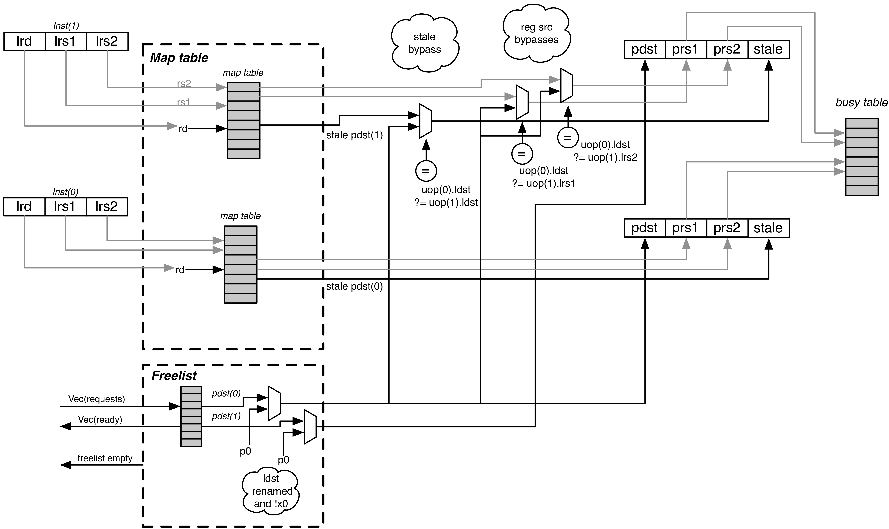

## 背景

最近要写超标量处理器的后端执行部分，看了姚永斌老师的《超标量处理器设计》后准备大展身手，结果发现很多细节实现方面存在问题，比如分支misprediction时各模块间如何配合清除错误的指令且不影响正常执行，因此想找一个开源的处理器学习一下，香山的代码相对来说比较复杂，最后选择了以更简单一点的BOOM作为参考，纯靠眼睛看代码结合文档理解，并且本人不太熟悉函数式编程，一些地方可能理解有误。

## 重命名

BOOM采用的是统一的物理寄存器实现重命名的设计，也就是所谓的“explicit renaming”，只有PRF，然后用单独的map table来管理映射关系，而另一种“implicit renaming”则是将结果写入ROB，然后ROB提交时才写回逻辑寄存器。

我原以为显式重命名应该是更先进的方式，但文档上说P4，ARM A57采用的是隐式重命名，更老的的MIPS R10K，Alpha 21264采用的是显式重命名，说明这两种设计算是各有取舍，上网查了一下Core架构和Zen架构都有显式的Rename alias table。

重命名模块的组成成分可以分为：Map Table、Free List、Busy Table三部分。



### Map Table

BOOM的map_table是常规的用逻辑寄存器号寻址的结构，我原以为能容纳更多checkpoint的CAM内容寻址结构会是主流，但根据目前看过的资料发现这种结构似乎不常用？典型例子我只看过姚老师书上的Alpha21264。


BOOM同时保存了推测执行的重命名表和提交之后才变化的committed map table，分支指令采用checkpoint/ snapshot保存当前的重命名表，misprediction时用其恢复，这种实现方面会导致checkpoint非常占面积，并且容纳的分支指令有限，不过free_list以及用于发射队列和ROB恢复的分支TAG也是有限的，在这种情况下即使重命名表checkpoint足够多也没法容纳过量的分支指令。


这部分代码还算比较好理解
```scala
  val map_table = RegInit(VecInit((0 until numLregs) map { i => i.U(pregSz.W) }))
  val com_map_table = RegInit(VecInit((0 until numLregs) map { i => i.U(pregSz.W) }))
  val br_snapshots = Reg(Vec(maxBrCount, Vec(numLregs, UInt(pregSz.W))))
```
`map_table`为推测执行的映射表，`com_map_table`为提交后更新的architecture map table，`br_snapshots`为checkpoint/snapshot，可以保存一整个映射表，maxBrCount默认为4，参数在`maxBrCount`中。
```scala
  val remap_pdsts = io.remap_reqs map (_.pdst)
  val remap_ldsts_oh = io.remap_reqs map (req => UIntToOH(req.ldst) & Fill(numLregs, req.valid.asUInt))

  val com_remap_pdsts = io.com_remap_reqs map (_.pdst)
  val com_remap_ldsts_oh = io.com_remap_reqs map (req => UIntToOH(req.ldst) & Fill(numLregs, req.valid.asUInt))

```
每个表项，检查每个修改重命名表的请求地址独热码的对应位来选择表项的下一个值，函数式编程实在不太容易一眼看出端倪，如果用verilog描述应该会很好理解。

```scala
  // Figure out the new mappings seen by each pipeline slot.
  for (i <- 0 until numLregs) {
    val remapped_row = (remap_ldsts_oh.map(ldst => ldst(i)) zip remap_pdsts)
      .scanLeft(map_table(i)) {case (pdst, (ldst, new_pdst)) => Mux(ldst, new_pdst, pdst)}

    val com_remapped_row = (com_remap_ldsts_oh.map(ldst => ldst(i)) zip com_remap_pdsts)
      .scanLeft(com_map_table(i)) {case (pdst, (ldst, new_pdst)) => Mux(ldst, new_pdst, pdst)}

    for (j <- 0 until plWidth+1) {
      remap_table(j)(i) := remapped_row(j)
      com_remap_table(j)(i) := com_remapped_row(j)
    }
  }
```
这部分是算出了`remap_table`和`com_remap_table`的中间态，也就是每条指令执行完后相应的map_table长啥样，这样在有多条分支指令时可以填入当前每条指令的snapshot，`remap_table`的第一维长度为`plWidth + 1`，第0个元素即为原来的`map_table`。

```scala
  // Create snapshots of new mappings.
  if (enableSuperscalarSnapshots) {
    for (i <- 0 until plWidth+1) {
      when (io.ren_br_tags(i).valid) {
        br_snapshots(io.ren_br_tags(i).bits) := remap_table(i)
      }
    }
  } else {
    assert(PopCount(io.ren_br_tags.map(_.valid)) <= 1.U)
    val do_br_snapshot = io.ren_br_tags.map(_.valid).reduce(_||_)
    val br_snapshot_tag   = Mux1H(io.ren_br_tags.map(_.valid), io.ren_br_tags.map(_.bits))
    val br_snapshot_table = Mux1H(io.ren_br_tags.map(_.valid), remap_table)
    when (do_br_snapshot) {
      br_snapshots(br_snapshot_tag) := br_snapshot_table
    }
  }

```
这部分就是在保存每条分支指令的snapshot，一种是一次可以有多条分支指令，另一种是只能有一条。最开始没看懂为啥循环长度为`plWidth + 1`，输入的`ren_br_tags`长度也为`plWidth + 1`，而ex3版本这部分循环长度为`plWidth`，然后发现

```scala
  ren2_br_tags(0).valid := false.B
  ren2_br_tags(0).bits  := DontCare
```

```scala
    ren2_br_tags(w+1).valid := ren2_fire(w) && ren2_uops(w).allocate_brtag
    ren2_br_tags(w+1).bits  := ren2_uops(w).br_tag
```

输入的0端口其实就是无效的，其他每部分都往后偏移一个单位，其实真正有效的输入只有`plWidth`个，然后每个输入都往后挪一个单位就行，这么处理可能是为了代码更好看，多出来的信号应该是会被优化掉的。

```scala
for (i <- 0 until plWidth) {
    io.map_resps(i).prs1       := (0 until i).foldLeft(map_table(io.map_reqs(i).lrs1)) ((p,k) =>
      Mux(bypass.B && io.remap_reqs(k).valid && io.remap_reqs(k).ldst === io.map_reqs(i).lrs1, io.remap_reqs(k).pdst, p))
    io.map_resps(i).prs2       := (0 until i).foldLeft(map_table(io.map_reqs(i).lrs2)) ((p,k) =>
      Mux(bypass.B && io.remap_reqs(k).valid && io.remap_reqs(k).ldst === io.map_reqs(i).lrs2, io.remap_reqs(k).pdst, p))
    io.map_resps(i).prs3       := (0 until i).foldLeft(map_table(io.map_reqs(i).lrs3)) ((p,k) =>
      Mux(bypass.B && io.remap_reqs(k).valid && io.remap_reqs(k).ldst === io.map_reqs(i).lrs3, io.remap_reqs(k).pdst, p))
    io.map_resps(i).stale_pdst := (0 until i).foldLeft(map_table(io.map_reqs(i).ldst)) ((p,k) =>
      Mux(bypass.B && io.remap_reqs(k).valid && io.remap_reqs(k).ldst === io.map_reqs(i).ldst, io.remap_reqs(k).pdst, p))

    if (!float) io.map_resps(i).prs3 := DontCare
  }
```
这部分处理了当前处理的几条指令存在RAW情况下后面读寄存器指令的操作数来源问题，以及WAW情况下后一条指令需要保存的旧的映射关系来源的问题，它们来自于分配给前一条写寄存器指令分配到的preg号而非map_table读出来的值（函数式编程还是不太容易看啊）


### Free List
```scala
  val free_list = RegInit(UInt(numPregs.W), io.initial_allocation)
  val spec_alloc_list = RegInit(0.U(numPregs.W)) // free_list和~spec_alloc_list的区别？
  val br_alloc_lists = Reg(Vec(maxBrCount, UInt(numPregs.W)))
```
Free List有三部分，`free_list`保存当前空闲的寄存器，`spec_alloc_list`保存目前处于推测状态的分配的寄存器，`br_alloc_lists`对应分支tag的snapshot。


```scala
  spec_alloc_list := (spec_alloc_list | alloc_masks(0)) & ~dealloc_mask & ~com_despec
```
<br>

```scala
  val rollback_deallocs = spec_alloc_list & Fill(n, io.rollback)
```

最开始没太看懂spec_alloc_list的作用，总感觉似乎和free_list只是取反的一个关系，实际并非如此，spec_alloc_list用于rollback，也就是消除当前的推测状态，即上面的rollback_deallocs，一条指令的pdst在ROB提交时即消除了推测的分配状态，因此在spec_alloc_list要置为0，但是这个pdst只有作为某条指令的stale_pdst被提交时才会被释放放回free_list，输入的com_despec即为当前提交指令的pdst

```scala
  // Update branch snapshots
  for (i <- 0 until maxBrCount) {
    val updated_br_alloc_list = if (isImm) {
      // Immediates clear the busy table when they read, potentially before older branches resolve.
      // Thus the branch alloc lists must be updated as well
      // 没看懂isImm
      br_alloc_lists(i) & ~br_deallocs & ~com_deallocs | alloc_masks(0)
    } else {
      br_alloc_lists(i) & ~br_deallocs | alloc_masks(0)
    }
    br_alloc_lists(i) := updated_br_alloc_list
  }
```
这部分就是更新一下`br_alloc_lists`，但是这个`isImm`目前看不太明白，两部分的区别就是有没有`~com_deallocs`，提交的指令肯定位于未处理的分支指令之前，释放的物理寄存器肯定也是之前申请的，`br_alloc_lists`对应的位肯定为0，有`~com_deallocs`似乎也没什么用？BOOM默认的参数里`isImm`也是直接写的false

```scala
  if (enableSuperscalarSnapshots) {
    val br_slots = VecInit(io.ren_br_tags.map(tag => tag.valid)).asUInt
    // Create branch allocation lists.
    for (i <- 0 until maxBrCount) {
      val list_req = VecInit(io.ren_br_tags.map(tag => tag.bits === i.U)).asUInt & br_slots
      val new_list = list_req.orR
      when (new_list) {
        br_alloc_lists(i) := Mux1H(list_req, alloc_masks)
      }
    }
  } else {
    assert(PopCount(io.ren_br_tags.map(_.valid)) <= 1.U)
    val do_br_snapshot = io.ren_br_tags.map(_.valid).reduce(_||_)
    val br_snapshot_tag   = Mux1H(io.ren_br_tags.map(_.valid), io.ren_br_tags.map(_.bits))
    val br_snapshot_list  = Mux1H(io.ren_br_tags.map(_.valid), alloc_masks)
    when (do_br_snapshot) {
      br_alloc_lists(br_snapshot_tag) := br_snapshot_list
    }
  }

```
这里对分支br_alloc_lists的记录巧用了前面的`scanRight`，`alloc_masks`每个元素对应的恰好就是该指令以及之后指令alloc到的物理寄存器，函数式编程还真有用，虽然还是不好理解

### Busy Table
```scala
  val wakeups = io.wakeups.map { w =>
    val wu = Wire(Valid(new Wakeup))
    wu.valid := RegNext(w.valid) && ((RegNext(w.bits.speculative_mask) & io.child_rebusys) === 0.U)
    wu.bits  := RegNext(w.bits)
    wu
  }
```
wakeup的信息会先寄存一拍再处理，看了一下v3版本是直接处理，目前不知道为何要这么设计

```scala
  // Read the busy table.
  for (i <- 0 until plWidth) {
    val prs1_match = wakeups.map { w => w.valid && w.bits.uop.pdst === io.ren_uops(i).prs1 }
    val prs2_match = wakeups.map { w => w.valid && w.bits.uop.pdst === io.ren_uops(i).prs2 }
    val prs3_match = wakeups.map { w => w.valid && w.bits.uop.pdst === io.ren_uops(i).prs3 }

    io.busy_resps(i).prs1_busy := busy_table(io.ren_uops(i).prs1)
    io.busy_resps(i).prs2_busy := busy_table(io.ren_uops(i).prs2)
    io.busy_resps(i).prs3_busy := busy_table(io.ren_uops(i).prs3)

    when (prs1_match.reduce(_||_)) {
      io.busy_resps(i).prs1_busy := Mux1H(prs1_match, wakeups.map { w => w.valid && w.bits.rebusy })
    }
    when (prs2_match.reduce(_||_)) {
      io.busy_resps(i).prs2_busy := Mux1H(prs2_match, wakeups.map { w => w.valid && w.bits.rebusy })
    }
    when (prs3_match.reduce(_||_)) {
      io.busy_resps(i).prs3_busy := Mux1H(prs3_match, wakeups.map { w => w.valid && w.bits.rebusy })
    }

    if (!float) io.busy_resps(i).prs3_busy := false.B

  }
```

`busy_table`的读逻辑会判断当前寄存下来的unbusy寄存器号是否和新增的rebusy寄存器号一致，如果一致则会有一个选择逻辑，理论上刚unbusy的寄存器估计也不会马上被释放，我估计这种情况不会太多


